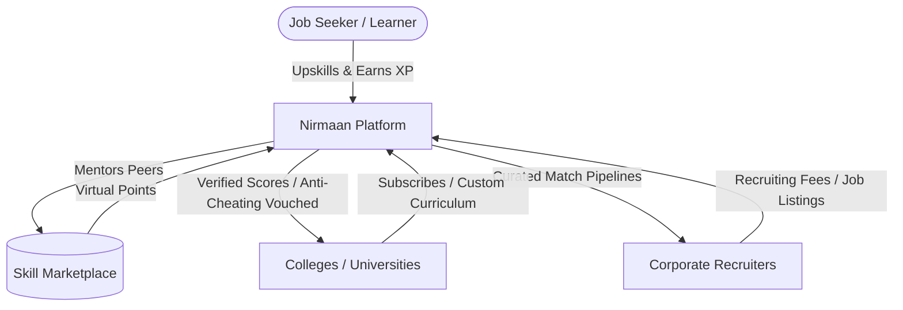
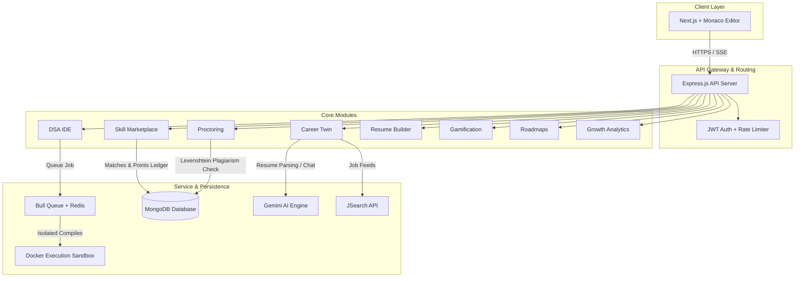

# Product Requirement Document (PRD): Nirmaan (Career OS)

---

## 1. Executive Summary & Vision

### 1.1. Introduction
**Nirmaan** (also known as **Career OS**) is an end-to-end, modular, AI-enabled career orchestration and capability development platform. Unlike traditional learning management systems or point solutions (e.g., resume builders, standalone mock interview tools, or basic coding judges), Nirmaan acts as a cohesive career development lifecycle system. It dynamically bridges the gap between learning, skill validation, credentialing, job matching, resume tailoring, and peer-to-peer mentoring.

### 1.2. Product Vision
Our vision is to empower individuals to navigate their career paths with a data-driven, interactive, and AI-augmented career co-pilot—the **Career Twin**—while fostering a gamified learning culture and a virtual economy built on peer-to-peer knowledge exchange. Nirmaan acts as a single pane of glass for candidates to upskill, practice DSA, get vouched by anti-plagiarism proctored systems, and apply to tailored job listings.

---

## 2. Business Model & Strategy

Nirmaan operates on a hybrid B2C and B2B model to unlock multiple revenue streams and build a self-sustaining talent flywheel.



### 2.1. B2C Model (Direct-to-Consumer)
*   **Freemium Upskilling & Practice:** Free access to baseline DSA problems, standard roadmaps, and basic mock interview questions.
*   **Virtual Points Economy:** Users earn virtual credits by helping peers on the **Skill Marketplace** (e.g., mock interview mock sessions, tutoring, code reviews). They spend credits to access premium AI mentor plans, advanced mock interviews, or custom roadmaps.
*   **Premium Upgrades:** Job seekers can purchase additional points packs or subscribe to a premium tier for unlimited AI-driven resume tailoring, real-time audio/voice mock interviews, and advanced ATS score auditing.

### 2.2. B2B Model (Enterprise & Institutional)
*   **University / College SaaS:** Universities pay a subscription fee for dedicated dashboards to track student performance, set custom DSA curricula, run internal contests, and monitor real-time class readiness metrics.
*   **Recruitment & Corporate Hiring:** Companies post jobs and pay for access to candidate pools. The key value proposition is our **Proctored & Plagiarism-Vouched Candidate Pipeline**—ensuring the candidates' high test scores are backed by webcam proctoring, blur detection, and code plagiarism logs.

---

## 3. Product Architecture Overview

The system is structured as a multi-tier, modular application designed to scale horizontally. 



---

## 4. Comprehensive Feature Specification (The 8 Core Modules)

---

### 4.1. Module 1: Resume Builder & ATS Optimizer

Manages professional profiles, parsing them into structured data, and optimizing them to bypass Applicant Tracking Systems (ATS).

#### 4.1.1. Core Features
*   **Structured Schema Management:** Standardize resumes into structured JSON blocks: Personal Details, Experience, Education, Skills, and Projects.
*   **AI Profile Generator:** Auto-populate fields using scraping tools or file uploads.
*   **Gemini-Powered ATS Scorer:** Compares a resume against a target job description and generates a score (0-100%) alongside actionable, line-item suggestions.
*   **Professional Summary Enhancer:** Contextually rewrite summary sections based on targeted industry roles (e.g., Senior Backend Engineer).
*   **Soft Deletion & Versioning:** Tracks historic modifications to revert or compare variations.

---

### 4.2. Module 2: Career Twin & Live Job Matching

The Career Twin is the AI-driven agent representing the user's professional persona. It crawls listings, calculates skill gaps, and practices interviews on behalf of the user.

```
Resume Upload ──> Skill Graph Extraction (Gemini) ──> Fetch Live Job Listings (JSearch)
                                                                 │
   Kanban Tracker <── Apply/Tailor Resume <── Fit Score (Gap Analyis) <──┘
```

#### 4.2.1. Core Features
*   **Skill Graph Extraction:** The Career Twin parses user profiles and builds an multi-dimensional skills taxonomy.
*   **Real-time Job Ingestion:** Integrates with JSearch RapidAPI to pull live job openings from 100+ job boards (LinkedIn, Indeed, ZipRecruiter) based on extracted skills.
*   **AI Fit Scoring:** Compares job requirements with candidate profiles, generating an overlap rating and detecting specific "missing skills".
*   **Resume Tailoring:** Automates context-based modifications to resumes for high-fit job opportunities.
*   **Application Kanban Pipeline:** Interactive board displaying candidates' funnels through stages: Saved, Applied, Interviewing, Offered, Rejected.

---

### 4.3. Module 3: DSA Practice & Code Execution IDE

A full-fledged coding playground for practicing Data Structures and Algorithms with real-time feedback, similar to LeetCode.

#### 4.3.1. Core Features
*   **Monaco Editor Integration:** Supports syntax highlighting, auto-complete, and indentation in the browser.
*   **Multi-Language Execution:** Supports compiling and executing in 7 programming languages: Python, JavaScript, Java, C++, C, Go, and Rust.
*   **Dockerized Sandbox Execution:** Isolated containers running Alpine Linux with strict resource thresholds:
    *   **CPU:** Single-core limit.
    *   **Memory:** 128MB maximum per runtime execution.
    *   **PIDs:** Max 50 processes to prevent fork-bombs.
    *   **Time Limit:** 5-second execution timeout.
    *   **Network:** Completely disabled within sandbox containers.
*   **Synchronous and Asynchronous execution:** Light validation runs synchronously; submission judging runs asynchronously via a Bull queue backed by Redis.
*   **AI-Powered Test Case Generator:** Gemini integration dynamically generates edge cases, corner cases, and stress tests (visible vs hidden) for any custom coding challenge.
*   **Server-Sent Events (SSE) Stream:** Client-side updates pushed via real-time SSE streams during container queueing and compilation states.

---

### 4.4. Module 4: Plagiarism & Online Proctoring Engine

Ensures integrity and prevents cheating during university tests, assessments, or coding contests.

#### 4.4.1. Core Features
*   **Proctor Session Lifecycle:** Explicit session initiation (`/start`), ongoing heartbeats (`/heartbeat`), and closure (`/finish`).
*   **Front-end Violation Tracker:** Logs critical front-end events:
    *   `tab_switch` (focus shifted away from tab)
    *   `window_blur` (user minimized or left application window)
    *   `fullscreen_exit` (user escaped restricted fullscreen mode)
    *   `copy_paste` / `rapid_paste` (flagging code copy-paste patterns)
*   **Webcam and Mic Monitoring (AI Proctoring):** Tracks missing faces, multiple faces, or background audio interruptions.
*   **Identifier Token Plagiarism Verification:** Matches submitted code against all previous entries for that problem using a dual-metric approach:
    1.  **Jaccard Similarity:** Compares identifier sets tokenized from code variables/functions to catch renaming tricks.
    2.  **Normalized Levenshtein Distance:** Character-level edit distance comparison on the first 2,000 characters to detect block modifications.
    3.  **Flagging System:** Automatically flags submissions with combined similarity above 70% and marks them for manual admin audit.
*   **Weighted Integrity Scoring:** Lowers overall score according to recorded violations.

---

### 4.5. Module 5: Skill Marketplace & Points Economy

A virtual marketplace facilitating peer-to-peer tutoring, mock interviews, and mentoring.

#### 4.5.1. Core Features
*   **Dual Profile Management:** Users define their `teachSkills` and `learnSkills` with experience levels (Beginner, Intermediate, Advanced, Expert) and calendar availability.
*   **Mentor Overlap Matcher:** Automatically pairs users who need to learn skills with peers qualified to teach them.
*   **Interactive Request Board:** Open board where users create requests (e.g., "Need mock system design interview prep"). Peers can claim, schedule, and complete these requests.
*   **Point-Ledger Transaction Engine:** Manages a virtual credit system. Completing mentoring sessions credits the mentor's wallet and deducts from the learner's balance.
*   **AI Mentor Mode:** If a peer mentor is unavailable, users can spend credits to launch an automated AI mentor plan—a step-by-step tutorial designed contextually by Gemini.
*   **External Profile Syncing:** Automatically imports achievements and skills from external accounts (GitHub, LeetCode, Codeforces) to build credibility.

---

### 4.6. Module 6: Gamification & Quests

Leverages gaming mechanics to boost user retention, engagement, and consistent upskilling habits.

```
Solve DSA Problems ──┐
Mock Interviews ─────┼──> Rules Engine ──> Award XP & Badges ──> Weekly Quests
Roadmap Completion ──┘
```

#### 4.6.1. Core Features
*   **Rules Engine:** Listens to platform-wide events (solved problems, mock interviews, updated resumes) and awards XP.
*   **Weekly Quests:** Recurring quests (e.g., "Solve 5 Medium DSA problems this week") that grant bonus points or badges.
*   **Leaderboard Scopes:** Displays rankings based on XP, DSA progress, or marketplace assistance, filtered globally or by university/college.
*   **XP History & Badges:** Tracks historic growth and awards achievements.

---

### 4.7. Module 7: Growth Analytics & Dashboard

Provides deep insight into learning progression, application funnels, and performance.

#### 4.7.1. Core Features
*   **Upskilling Funnels:** Tracks conversion rates from "Roadmap Created" to "Milestones Completed".
*   **Marketplace Analytics:** Tracks sessions completed, points earned/spent, and average user reviews.
*   **Application Funnel Metrics:** Calculates job application conversion rates (Applied -> Interviewed -> Offer).
*   **Skill Gap Analytics:** Visually compares current skills against market demand in real-time.

---

### 4.8. Module 8: Career Roadmaps

Helps job seekers construct a visual progression timeline to acquire specialized skills.

#### 4.8.1. Core Features
*   **Roadmap Generation:** Generates learning paths from current roles, target goals, timelines (3, 6, 12, 18, 24 months), and current skills.
*   **Interactive Progress Tracker:** Allows users to mark milestones as complete.
*   **Skill-gap Integration:** Links missing skills directly to specific roadmap milestones.

---

## 5. Technical Stack & Infrastructure

The core components of Nirmaan's technical stack include:

| Layer | Technology | Key Purpose |
| :--- | :--- | :--- |
| **Frontend** | Next.js 14, React 18, Monaco Editor, Tailwind CSS, Framer Motion | Dynamic UI, real-time code editor, responsive design, animations |
| **Backend** | Node.js 18, Express.js, Joi, Winston | High-performance backend API routing and logging |
| **Database** | MongoDB 7.0 (Mongoose ODM) | Document database for flexible data structures |
| **Queue / Cache** | Redis 7.0, Bull Queue | Async job execution, session caching, and rate limiting |
| **Execution** | Docker SDK (Dockerode) | Isolated, secure container environments for compiling code |
| **Integrations**| Gemini API, JSearch RapidAPI | Resume parsing, AI feedback, mock chats, live job listings |

---

## 6. Database ERD & Schema Models

The database is built on a NoSQL document model using MongoDB. The schema designs represent the core entities:

```
                  ┌─────────────────┐
                  │      USER       │
                  └────────┬────────┘
                           │ 1:1
        ┌──────────────────┼─────────────────┬──────────────────┐
        │ 1:M              │ 1:M             │ 1:M              │ 1:M
┌───────▼───────┐  ┌───────▼───────┐ ┌───────▼───────┐  ┌───────▼───────┐
│    RESUME     │  │ ROADMAP       │ │  GAMIFICATION │  │ SKILL_PROFILE │
└───────┬───────┘  └───────────────┘ └───────────────┘  └───────┬───────┘
        │ 1:M                                                   │ 1:M
┌───────▼───────┐                                       ┌───────▼───────┐
│ APPLICATIONS  │                                       │   SESSIONS    │
└───────────────┘                                       └───────┬───────┘
                                                                │ 1:M
                                                        ┌───────▼───────┐
                                                        │    REVIEWS    │
                                                        └───────────────┘
```

### 6.1. User Schema (`users`)
Tracks account credentials and profile metadata.
*   `_id` (ObjectId)
*   `name` (String)
*   `email` (String)
*   `password` (String, hashed)
*   `role` (String: `'user'`, `'admin'`, `'instructor'`)
*   `college` (String, optional)
*   `createdAt` / `updatedAt` (ISODate)

### 6.2. Career Twin Profile Schema (`career_twin_profiles`)
Defines the AI agent configuration for the user.
*   `_id` (ObjectId)
*   `userId` (ObjectId -> User)
*   `skills` (Array of Strings)
*   `preferredLocation` (String)
*   `salaryExpectation` (Number)
*   `industries` (Array of Strings)
*   `matchPreferences` (Object)

### 6.3. Job Schema (`jobs`)
Stores ingested job data normalized across boards.
*   `_id` (ObjectId)
*   `title` (String)
*   `company` (String)
*   `location` (String)
*   `description` (String)
*   `skillsRequired` (Array of Strings)
*   `salaryRange` (String)
*   `sourceUrl` (String)
*   `sourceBoard` (String: `'LinkedIn'`, `'Indeed'`, `'JSearch'`)
*   `fitScore` (Number, dynamic)

### 6.4. Application Schema (`applications`)
Tracks candidates' progress through job funnels.
*   `_id` (ObjectId)
*   `userId` (ObjectId -> User)
*   `jobId` (ObjectId -> Job)
*   `status` (String: `'saved'`, `'applied'`, `'interviewing'`, `'offered'`, `'rejected'`)
*   `appliedDate` (ISODate)
*   `notes` (String)
*   `tailoredResumeId` (ObjectId -> Resume)

### 6.5. Interview Question Schema (`interview_questions`)
Problem pool metadata for the IDE coding interface.
*   `_id` (ObjectId)
*   `title` (String)
*   `description` (String)
*   `difficulty` (String: `'easy'`, `'medium'`, `'hard'`)
*   `category` (String: `'Array'`, `'String'`, `'Dynamic Programming'`)
*   `constraints` (Array of Strings)
*   `functionSignature` (Object containing entry points for Python, Java, C++, JS, Go, Rust)
*   `examples` (Array of objects with `input`, `output`, `explanation`)
*   `starterCode` (Array of objects with `language`, `code`)
*   `solutions` (Array of objects with `language`, `code`)
*   `acceptedCount` / `submissionCount` (Number)

### 6.6. TestCase Schema (`test_cases`)
*   `_id` (ObjectId)
*   `questionId` (ObjectId -> InterviewQuestion)
*   `input` (String)
*   `expected` (String)
*   `explanation` (String)
*   `isVisible` (Boolean)
*   `category` (String: `'sample'`, `'edge_case'`, `'stress'`)

### 6.7. Execution Result Schema (`execution_results`)
Saves code evaluation metadata.
*   `_id` (ObjectId)
*   `userId` (ObjectId -> User)
*   `questionId` (ObjectId -> InterviewQuestion)
*   `sourceCode` (String)
*   `language` (String)
*   `verdict` (String: `'Accepted'`, `'Wrong Answer'`, `'TLE'`, `'MLE'`, `'Compilation Error'`)
*   `testCasesPassed` (Number)
*   `totalTestCases` (Number)
*   `executionTime` (Number)
*   `memoryUsed` (Number)

### 6.8. Proctor Session Schema (`proctor_sessions`)
Stores logging reports from assessments.
*   `_id` (ObjectId)
*   `userId` (ObjectId -> User)
*   `interviewSessionId` (ObjectId)
*   `startTime` / `endTime` (ISODate)
*   `status` (String: `'active'`, `'completed'`, `'auto_submitted'`, `'abandoned'`)
*   `violations` (Array of objects containing `type`, `timestamp`, `detail`, `severity`)
*   `violationCounts` (Object summarizing violations)
*   `submissionHashes` (Array of objects containing `questionId`, `codeHash`, `rawCode`, `similarity`, `flagged`)
*   `scoring` (Object with `testCasePct`, `violationPenalty`, `finalScore`)

### 6.9. Skill Profile Schema (`skill_profiles`)
Facilitates mentoring match structures.
*   `_id` (ObjectId)
*   `userId` (ObjectId -> User)
*   `teachSkills` (Array of objects with `name`, `experienceLevel`)
*   `learnSkills` (Array of objects with `name`, `experienceLevel`)
*   `availability` (Array of objects with `day`, `startTime`, `endTime`, `timezone`)

### 6.10. Points Ledger Schema (`points_ledger`)
Calculates wallet point values.
*   `_id` (ObjectId)
*   `userId` (ObjectId -> User)
*   `points` (Number)
*   `history` (Array of objects containing `amount`, `type`, `description`, `timestamp`)

---

## 7. Key Data Flows

### 7.1. Asynchronous Code Execution Flow
Submission execution runs asynchronously using a Redis-backed queue to maintain platform reliability during heavy user loads.

```
[ Monaco Editor ] ──(Submit Code)──> [ API Router ]
                                         │
[ SSE /execution-stream/:jobId ]         ├─> (Fetch all Test Cases)
   │                                     ├─> (Enqueue job in Redis Queue)
   │                                     └─> (Return `jobId` immediately)
   │                                              │
   ├─< (Polls Job Queue Status) <─────────────────┘
   │
   ├─> [ Status: queued (waiting) ]
   ├─> [ Status: running (compiling/executing in Docker) ]
   └─> [ Status: completed/failed ] ──> (Save ExecutionResult) ──> [ Show Verdict ]
```

---

## 8. Non-Functional Requirements & Performance Targets

### 8.1. Performance & Execution Speed
*   **API Response Time:** All data endpoints (Roadmaps, Resumes, Profiles) must respond within `<500ms`.
*   **Synchronous Run Code:** Code execution on visible test cases should complete within `<3 seconds`.
*   **Asynchronous Submit Code:** Complete evaluation across all test cases (up to 50 test cases) should execute and return a verdict within `<15 seconds`.

### 8.2. Security, Compliance, & Proctoring
*   **Docker Isolation:** Sandboxed execution environments must operate without root network privileges (`--net=none`) and run under custom read-only profiles to protect the host filesystem.
*   **Input Validation:** All input payloads must be filtered using Joi schemas to prevent injection attacks.
*   **Webcam and Clipboard Privacy:** Webcam video frames processed via client-side models to avoid server storage overhead. Tab focus is checked via browser APIs.

### 8.3. Availability & Reliability
*   **Fallback execution:** If Docker service experiences outages, requests must fail-over to the Judge0 API.
*   **Database persistence:** Database collections must back up weekly.

---

## 9. Release Roadmap & Implementation Phases

The platform rollout is divided into four distinct product phases:

```
[ Phase 1: Core Systems ] ──> [ Phase 2: Live Integrations ] ──> [ Phase 3: AI Proctor & Audio ] ──> [ Phase 4: Enterprise ]
- Docker Sandbox Engine       - JSearch API Matching             - Whisper Audio Mock Chats           - Plagiarism Indexing
- Monaco IDE Integration      - Kanban Tracking UI               - Webcam Face Detection              - University Dashboards
- MongoDB Schemas             - Mentorship Match                 - Points Transaction Gateway         - Partner Recruiter Board
```

### 9.1. Phase 1: Core Execution Engine & IDE (Completed)
*   Docker Sandbox Executor.
*   Bull Queue integration.
*   Monaco IDE interface.
*   Initial MongoDB models.

### 9.2. Phase 2: Career Twin & Live Integrations (Completed)
*   JSearch API live matching.
*   Resume parsing and ATS checker.
*   Mentor Matching.
*   Kanban Application Tracker.

### 9.3. Phase 3: AI Proctoring, Audio, & Billing (In Progress)
*   Whisper Audio integration for mock interviews.
*   Client-side facial monitoring.
*   Points transaction gateway.
*   Comprehensive testing of proctor modules.

### 9.4. Phase 4: Enterprise features & Scaling
*   University Dashboards.
*   Enterprise Recruiter interface.
*   Plagiarism Index.
*   Native LinkedIn application sync.

---
*Status: Production-Ready Draft*
*Prepared for: Nirmaan Engineering and Product Teams*
*Date: July 2, 2026*
